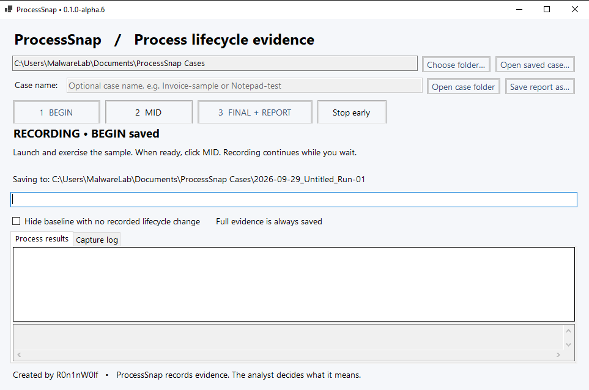
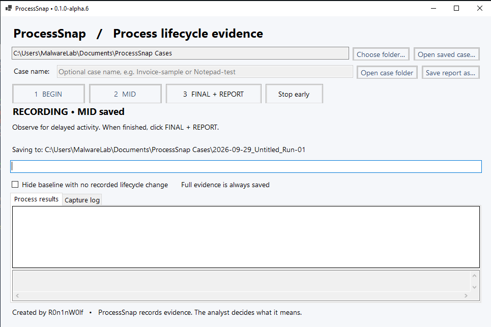
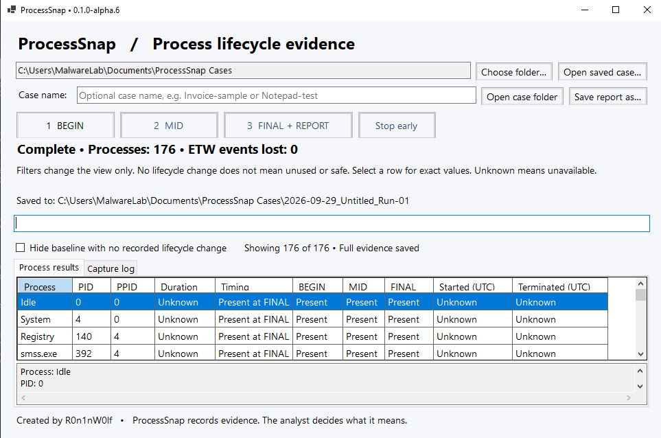
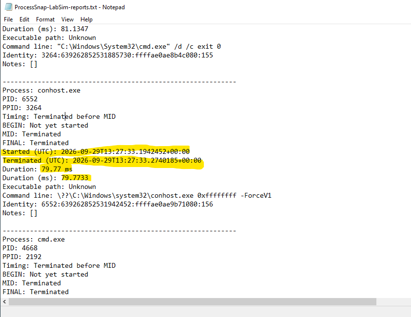
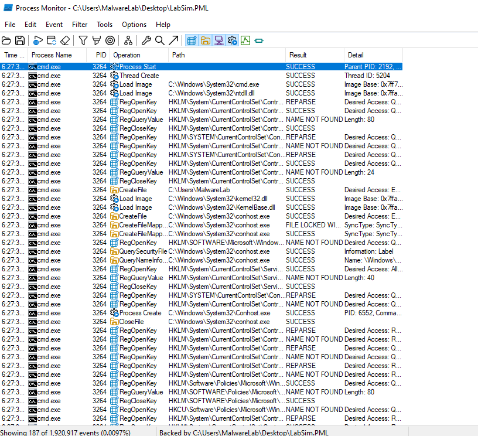
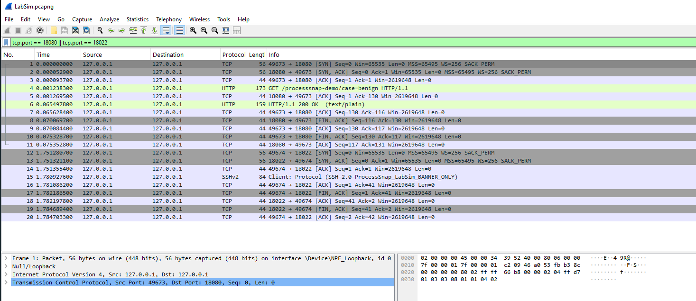

# ProcessSnap lab demonstration: preserving short-lived process evidence

**By Ronald / R0n1nW0lf · ProcessSnap v0.1.0-alpha.6 · Windows lab**

A process can start and exit before an analyst reaches the next checkpoint. In this controlled test, ProcessSnap retained a **79.77 ms console helper** and its parent process, allowing their relationship to be reviewed after both had exited.

I used a benign simulator to exercise process creation, parent/child relationships, synthetic file activity, and local network traffic. No malware samples were used. The simulator's network destinations were restricted to **127.0.0.1**.

> **Development note:** This demonstration is part of ongoing testing. I’m actively improving ProcessSnap, with clearer visual reports and highlighted process activity planned for an upcoming release.

## 1. Prepare the capture

ProcessSnap starts in a ready state. I prepared the lab and comparison tools before beginning the observation window.


## 2. BEGIN — establish the baseline

BEGIN saves the baseline and starts continuous process-lifecycle recording. The baseline provides context for identifying processes created during the test.



## 3. MID — mark progress while recording continues

MID marks an analyst checkpoint without stopping collection. Processes that started and exited before this checkpoint can still appear in the final evidence.



## 4. FINAL — preserve the results

FINAL stops recording and produces the report. This run contained **176 process records** and reported **0 ETW events lost**. The total includes baseline processes and Windows helper activity, not just simulator processes. Zero reported loss does not guarantee complete coverage.



## 5. Review a process that lasted less than a tenth of a second

The report retained this execution chain:

```text
powershell.exe — PID 2192 — simulator
└── cmd.exe — PID 3264 — /d /c exit 0 — 81.13 ms
    └── conhost.exe — PID 6552 — console helper — 79.77 ms
```

For the console helper, BEGIN is “Not yet started,” while MID and FINAL are “Terminated.” Its start and termination timestamps show that it ran entirely between BEGIN and MID. The yellow marks below draw attention to those timestamps and duration.



The full report contained **20 cmd.exe entries** matching the simulator's immediate-exit command and **eight PowerShell worker entries**. Their parent relationships match the simulator's expected 27 direct children and one grandchild. This is consistency with the test design, not an independently measured capture rate for every event.

**Evidence limitation:** The executable-path field was “Unknown” in this capture, even where command-line text included a path. Command-line text is useful context, but it is not independently verified executable identity.

## 6. Cross-check the process relationship with Procmon

> **Analogy:** Procmon contains the haystack of detailed system activity. ProcessSnap is the metal detector that helps point the analyst toward the needle — the process, PID, parent/child relationship, and time window worth investigating. **ProcessSnap tells you where to look; Procmon tells you what happened there.**

In the original Procmon screenshot, the **Process Start** row identifies cmd.exe PID **3264** with parent PID **2192**. A **Process Create** row records conhost.exe with child PID **6552**.

These observations corroborate the same process chain in ProcessSnap. The displayed Procmon times are truncated, so this screenshot does not independently verify the exact 81.13 ms lifetime.



## 7. Examine the network activity separately in Wireshark

The loopback capture shows:

| Packet | Observed evidence |
| --- | --- |
| 4 | HTTP GET for `/processsnap-demo?case=benign` |
| 6 | HTTP `200 OK` response |
| 15 | `SSH-2.0-ProcessSnap_LabSim_BANNER_ONLY` identification string |

All displayed endpoints are **127.0.0.1**. The SSH-style exchange is a banner test, not a completed encrypted or authenticated SSH session.



ProcessSnap records the worker processes and their lifecycles; Wireshark supplies packet evidence. The ProcessSnap report alone does not prove a network request succeeded, and this packet screenshot alone does not establish which Windows PID owned each connection.

## 8. Reduce baseline clutter without deleting evidence

Enabling **Hide baseline with no recorded lifecycle change** reduced the exported view from **176 to 64 entries**. The filtered report retained the 20 immediate-exit processes, eight simulator workers, and the example process chain above.

The saved text report sizes were approximately **94.8 KB unfiltered** and **34.8 KB filtered**—about **63% smaller**. This is a reduction in exported text, not a performance benchmark. The original capture evidence remains unchanged.

## What this test demonstrates

- Process-lifecycle evidence can remain available after short-lived processes exit.
- Parent IDs and command lines help reconstruct the execution sequence.
- Separate tools can corroborate different parts of the same controlled test.
- Baseline filtering makes a report easier to review without removing the underlying evidence.

This is a benign functional demonstration, not a malware-detection verdict, comprehensive accuracy benchmark, or claim that every event was captured.

## Planned reporting improvements

The next reporting work is focused on a clearer HTML view: highlight observed process starts during the capture, distinguish BEGIN-to-MID from MID-to-FINAL activity, show parent/child context, and collapse unchanged baseline entries.

For example, a prominent **“Started and exited between BEGIN → MID · 79.77 ms”** label would make the key evidence easier to find. A process already present at BEGIN must remain labeled as baseline—not as “never ran.” These improvements are planned and are not shown as implemented in this alpha release.

## Evidence presentation

The screenshots use a dedicated lab account and synthetic activity. Procmon and Wireshark images here are the original captures, rather than AI-recreated highlighted copies. Raw case exports and packet files are not included in this public page.

[Back to ProcessSnap](../../README.md) · [Alpha release](https://github.com/R0n1nW0lf/ProcessSnap/releases/tag/v0.1.0-alpha.6)
